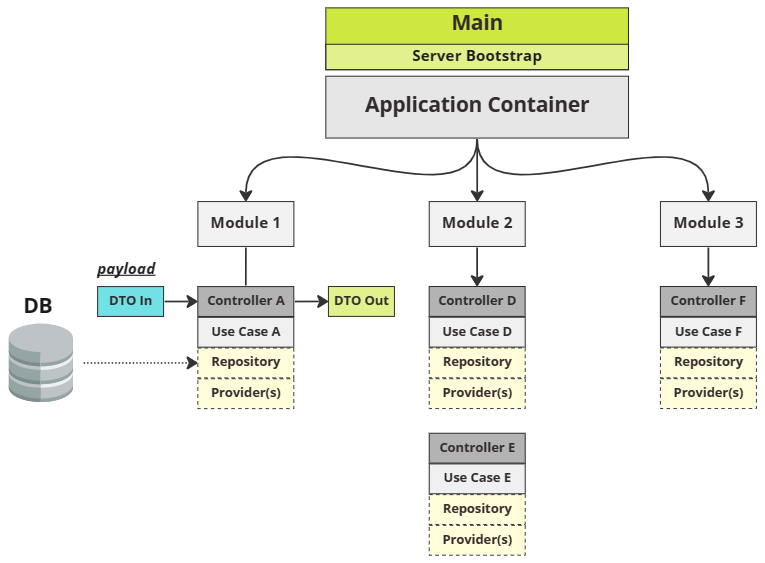
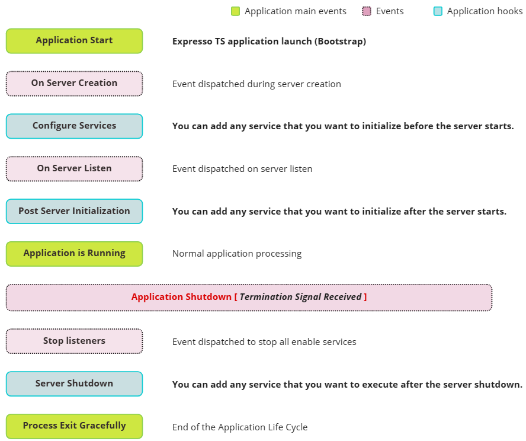

# Application

The Application Overview provides a comprehensive demonstration of the main components of an Expresso TS application. At the heart of an Expresso TS application lies the Application class, which serves as the foundation for creating and configuring the server. Additionally, the Application class makes use of the application container from Inversify that loads all the modules, including their respective routes [controllers]. This ensures a streamlined and efficient process for handling incoming requests and delivering the appropriate responses.



Expresso TS is a web application framework that provides a simple wrapper around popular HTTP servers like [Express](https://expressjs.com), [Fastify](https://www.fastify.io/), or [Koa](https://koajs.com/).

:::info
Currently, Expresso TS only supports Express, as we tested it thoroughly.
:::

The architecture of an Expresso TS application is based on [Inversify's](https://inversify.io/) IoC container, which is used to identify and inject dependencies into class constructors. This approach allows the IoC container to load all the necessary modules, including their respective routes (controllers). By using use-cases and providers as needed, routers can handle incoming requests.

By leveraging the power of Inversify, Expresso TS provides a scalable and modular architecture that helps to decouple components and improve maintainability. This allows developers to focus on writing clean and maintainable code, rather than worrying about dependency management.

## Application Components Breakdown

| Component             | Description                                                                                                                                                                                                                                                                                                                                                      |
| --------------------- | ---------------------------------------------------------------------------------------------------------------------------------------------------------------------------------------------------------------------------------------------------------------------------------------------------------------------------------------------------------------- |
| DTO IN / OUT          | Data transfer object that defines the format of the incoming and outgoing payload of the application.                                                                                                                                                                                                                                                           |
| Controller            | Component responsible for processing requests and responses based on the URL and HTTP method. It also validates the conformity of the incoming data.                                                                                                                                                                                                           |
| Use Case              | Component responsible for implementing the logic required to handle requests received from the controller. When the controller receives an HTTP request and validates the incoming data, it triggers the relevant use case, passing along the validated data for processing. The use case performs the necessary operations based on the request and returns the appropriate response to the controller, which then sends the response back to the client. |
| Provider | Component responsible for providing external functionality to the application. |
| Repository | Component responsible for providing access to the database. |

:::info
Providers and Repositories are optional components. You can use them if you need to provide external functionality or access to the database.
:::

## Workflow

The workflow of an Expresso TS application is straightforward, as shown in the diagram above. After initializing the application with all its components, including the container, modules, and controllers, the server starts listening for incoming requests. When a request is received, the server looks for the corresponding route and executes the associated controller, which typically exposes endpoints. The controller then calls the relevant use-case, which in turn calls the appropriate provider when required. Providers are external components that offer additional functionality to the application.

:::warning Initializing the Application without a controller
Expresso TS will prevent you to do that as there are no listeners to handle incoming requests. You will see the following message in the console:
***No controllers have been found! Please ensure that you have register at least one Controller.***
:::

## Application Class

The Application class offers a way of creating and configuring the server, passing [Expressjs middlewares](https://expressjs.com/en/guide/writing-middleware.html) or other middlewares upon server creation.

Also provides a listen method that starts the server and listens for incoming requests. In the listen method, developers can define not just the port number but also the server environment, which can be either development, staging, or production. As well as the developers can set the application name and version to be displayed in the console when the server starts, as shown in the following example:

:::info
We also provide an instance of the Application class called **AppInstance**, which only exposes the create and listen methods to the developer. This is beneficial when you need to quickly create a server without having to create a new class that extends the Application class and access its lifecycle methods.
:::

### Application Create

```typescript
// App create method
const app = App.create(container, [
    cors(),
    cookieParser(),
    express.static(path.join(__dirname, "public"))
]);
```

### Application Listen

```typescript
// App listen method
app.listen(3000, ServerEnvironment.Development, {
    appName: "Your App Name",
    appVersion: "v1.0.0"
})
```

:::tip
The name and version of your app can be configured via either the .env file or package.json file. In the opinionated template, we use the package.json file to retrieve the app name and version.
:::

### Application Server Environment

For now this is a working progress functionality. What it does is simply display the environment in the console when the server starts. The colored console message helps developers to quickly identity the environment the server is running on.

:::caution SPOILER ALERT
The idea is to actually load all the environment variables corresponding to the environment the server is running on.
:::

## Application Lifecycle Hooks

Another important aspect of the Application class is life cycle hooks. These hooks allow developers to execute code before, after and on shutdown of the server. Important to note that in order to take advantage of these hooks, developers must created an App Class extending the Application class and override the methods as needed. The following example shows the life cycle hooks available at the moment:

```typescript
    /* Add any service that you want to be initialized before the server starts */
    protected configureServices(): void { }

    /* Add any service that you want to execute after the server starts */
    protected postServerInitialization(): void { }

    /* Add any service that you want to execute after server is shutdown */
    protected serverShutdown(): void {
        process.exit(0);
     }
```

### Hooks Execution Order



## Application Scripts

Please see below all the available scripts that you can use to run, build and test your application.
The command column shows NPM as the package manager, but you can use Yarn or any other package manager of your choice.

| Script      | Description                                        | Command                      |
| ----------- | -------------------------------------------------- | ---------------------------- |
| build       | Build the production bundle in a ./dist folder     | npm run build                |
| dev         | Runs in development watch mode                     | npm run dev                  |
| prod        | Runs in production mode based on built bundle      | npm run prod                 |
| test        | Run your tests located in the test folder          | npm run test                 |
| test:watch  | Run your tests in watch and interactive mode       | npm run test:watch           |
| test:cov    | Produces test coverage report                      | npm run test:cov             |
| format      | Format the code using prettier                     | npm run format               |
| lint        | Lint code using eslint                             | npm run lint                 |

## Running the Application

```bash
npm run dev
```

Depending on the environment you are running the application, you will see the following message in the console:

`expressots-demo version 1.0.0 is running on port 3000 - Environment: development`

---

## Support the project

Expresso TS is an MIT-licensed open source project. It's an independent project with ongoing development made possible thanks to your support. If you'd like to help, please consider:

- Become a sponsor on GitHub (work in progress)
- Follow the **[organization](https://github.com/expressots)** on GitHub and Star ⭐ the project
- Subscribe to the Twitch channel: **[Richard Zampieri](https://www.twitch.tv/richardzampieri)**
- Join our [Discord](https://discord.com/invite/PyPJfGK)
- Contribute submitting **[issues and pull requests](https://github.com/expressots/expressots/issues/new/choose)**
- Share the project with your friends and colleagues