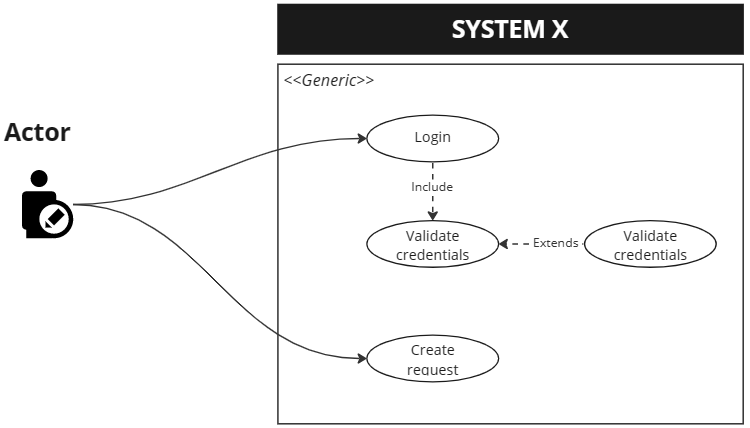

# Use Cases

From a UML standpoint, use cases provide a way to model the interactions between users, other systems, and a software application. A use case describes a specific scenario or flow of events between the actors and the system, leading to a certain outcome. In the context of Expresso TS, use cases serve to represent the business logic of the application, allowing for a clear separation between the controller and the request execution.

It is best practice to have one use case per controller, with the controller being responsible for calling the corresponding use case that will implement the business logic of the request. The request payload, also known as request DTO in Expresso TS, contains the information required to execute the use case.

A use case in Expresso TS contains only the business logic of the application, keeping it separate from the controller logic. It is common to have response DTOs as part of the use case, defining the response format of the request. The use case typically contains a single function called "execute", responsible for executing the logic of that particular use case.

:::tip
It is worth noting that having multiple use cases implemented within a single class violates the single responsibility principle and should be avoided.
:::

Here is an example of a use case diagram for a project x:



In the use case diagram above, the actor represents the user interacting with the system. To execute the Login use case, the user must provide specific information known as the payload or, in the case of Expresso TS, the request DTO. This information is necessary to trigger the use case and for the system to deliver the desired outcome.

It is important to note that the use case should exclusively contain the business logic of the application, with no additional or unrelated functionalities. This approach helps to ensure a clear separation of concerns, promoting maintainability, and scalability of the system.

Here is our Expresso TS simple implementation of the use case:

```typescript
@provide(LoginUseCase)
class LoginUseCase {
  execute(): boolean {
    return true;
  }
}

export { AppUseCase };
```

The implementation of use cases in Expresso TS follows the best practices of software design, where each use case is responsible for implementing a specific business logic. As shown in the example code snippet, a use case typically contains only one function, called execute, which is responsible for executing the business logic defined in that use case. The use case may also include a response DTO that defines the format of the response for that particular use case.

In addition, it is common to use constructors in the use cases to inject dependencies, such as providers and repositories. This allows for better modularity and testability of the code.

It is important to adhere to the principle of single responsibility when implementing use cases. Each use case should only handle a specific business logic, and if you find yourself implementing multiple use cases in a single class, it is time to review your implementation to ensure that each use case has a clear and concise responsibility.

## Support the project

ExpressoTS is an MIT-licensed open source project. It's an independent project with ongoing development made possible thanks to your support. If you'd like to help, please consider:

- [Become a sponsor on GitHub]("")
- Follow the organization on GitHub and Star the project
- Subscribe to the Twitch channel: [Richard Zampieri](https://www.twitch.tv/richardzampieri)
- Contribute submitting issues and pull requests
- Share the project with your friends and colleagues